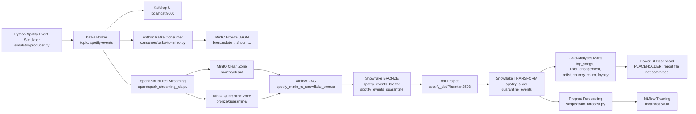

# Spotify MDS Project

End-to-end Spotify-style music streaming data platform built for data engineering, analytics, and forecasting practice. The project simulates user listening events, streams them through Kafka, stores raw/validated data in MinIO, loads data into Snowflake with Airflow, transforms it with dbt, trains a Prophet forecasting model, and tracks experiments with MLflow.

> Status: This repository contains working source code and local setup notes. Some production artifacts are not committed, including a Power BI report file and a license file. Those gaps are marked as placeholders below.

## Project Overview

This project models a modern analytics pipeline for streaming music events:

1. `simulator/producer.py` generates fake Spotify-like events with users, songs, artists, countries, devices, subscriptions, and timestamps.
2. Kafka receives events on the configured topic, normally `spotify-events`.
3. Data can be written to MinIO through either:
   - `consumer/kafka-to-minio.py`, which batches Kafka messages into JSON files.
   - `spark/spark_streaming_job.py`, which reads Kafka with Spark Structured Streaming, validates events, and writes clean and quarantine streams separately.
4. `docker/dags/minio-to-snowflake.py` is an Airflow DAG that reads clean/quarantine JSON files from MinIO and loads them into Snowflake Bronze tables.
5. `spotify_dbt/Phamtan2503` transforms Bronze data into Silver and Gold analytics models.
6. `scripts/train_forecast.py` reads daily play counts from Snowflake, trains a Prophet model, and logs metrics/parameters to MLflow.
7. Power BI can connect to Snowflake Gold models for dashboards.

## Architecture Diagram



## Features

- Synthetic Spotify event generation with Faker.
- Kafka streaming ingestion with local Kafka and Zookeeper.
- Kafdrop web UI for inspecting Kafka topics and messages.
- MinIO S3-compatible local data lake.
- Optional Spark Structured Streaming validation layer.
- Clean and quarantine data separation.
- Airflow orchestration with hourly DAG scheduling.
- Snowflake Bronze table loading from MinIO.
- dbt Silver and Gold transformation models.
- Prophet forecasting for daily play counts.
- MLflow experiment tracking for model metrics and parameters.
- Power BI-ready Snowflake Gold marts.

## Tech Stack

| Layer | Tools |
|---|---|
| Data simulation | Python, Faker |
| Streaming | Apache Kafka, Zookeeper, kafka-python |
| Stream processing | Apache Spark 3.5.1, PySpark |
| Data lake | MinIO, boto3, S3-compatible paths |
| Orchestration | Apache Airflow 2.9.3, PostgreSQL metadata DB |
| Warehouse | Snowflake |
| Transformation | dbt Core 1.7, dbt Snowflake |
| Machine learning | Prophet, pandas |
| Experiment tracking | MLflow 2.11.0 |
| Visualization | Power BI, Kafdrop, MinIO Console, Airflow UI |
| Infrastructure | Docker Compose |

## Project Structure

```text
spotify-mds-project/
|-- consumer/
|   |-- kafka-to-minio.py          # Kafka consumer that batches events into MinIO JSON files
|   |-- *.txt                      # Learning/setup notes
|-- docker/
|   |-- docker-compose.yml         # Local services: Kafka, Spark, MinIO, Airflow, PostgreSQL, MLflow
|   |-- dags/
|   |   |-- minio-to-snowflake.py  # Airflow DAG loading MinIO clean/quarantine data to Snowflake
|   |   |-- .env                   # Airflow DAG runtime variables, ignored by git
|   |-- kafka/kafka.properties     # Kafka broker properties mounted into container
|   |-- logs/                      # Airflow runtime logs
|   |-- *.txt                      # Docker/service notes
|-- scripts/
|   |-- train_forecast.py          # Prophet training + MLflow tracking
|   |-- requirements.txt           # MLflow/Prophet install notes
|-- simulator/
|   |-- producer.py                # Fake Spotify event producer
|   |-- songs_data.py              # Song/artist catalog used by producer
|   |-- main.py                    # PyCharm starter file, not part of pipeline
|-- spark/
|   |-- spark_streaming_job.py     # Kafka-to-MinIO clean/quarantine Spark stream
|   |-- *.txt                      # Spark setup notes
|-- spotify_dbt/Phamtan2503/
|   |-- dbt_project.yml            # dbt project config
|   |-- models/
|   |   |-- sources.yml            # Snowflake Bronze source definition
|   |   |-- schema.yml             # dbt tests for spotify_silver
|   |   |-- silver/                # Silver cleaning and quarantine models
|   |   |-- gold/                  # Analytics marts and dimensions
|-- requirements.txt               # Main Python dependency list
|-- summary_pipeline.txt           # Project summary notes
|-- setup.txt                      # GitHub setup notes
```

## Prerequisites

Install these before running the project:

| Requirement | Recommended Version | Notes |
|---|---:|---|
| Git | Latest | Clone and manage the repository |
| Docker Desktop | Latest | Required for Kafka, MinIO, Airflow, PostgreSQL, Spark, MLflow |
| Docker Compose | v2 | Usually included with Docker Desktop |
| Python | 3.10 or 3.11 | Use a virtual environment |
| Java JDK | 11+ | Required for Spark/PySpark |
| Snowflake account | Any active account | Required for warehouse loading and dbt |
| Power BI Desktop | Latest | Optional, for dashboarding |

Windows note: `spark/spark_streaming_job.py` currently hardcodes:

```python
JAVA_HOME = C:\Program Files\Eclipse Adoptium\jdk-11.0.31.11-hotspot
HADOOP_HOME = D:\hadoop
```

Update those paths if your local Java or Hadoop Winutils installation is different.

## Detailed Installation Guide

### 1. Clone the Repository

```bash
git clone https://github.com/batanvlog2503/spotify-mds-project.git
cd spotify-mds-project
```

If you already have the project locally:

```bash
cd spotify-mds-project
```

### 2. Docker Setup

The Docker Compose file is in `docker/docker-compose.yml`.

Create `docker/.env`:

```env
MINIO_ROOT_USER=minioadmin
MINIO_ROOT_PASSWORD=minioadmin123

POSTGRES_USER=airflow
POSTGRES_PASSWORD=airflow
POSTGRES_DB=airflow

AIRFLOW_ADMIN_USER=admin
AIRFLOW_ADMIN_PASSWORD=admin
AIRFLOW_ADMIN_FIRSTNAME=Admin
AIRFLOW_ADMIN_LASTNAME=User
AIRFLOW_ADMIN_EMAIL=admin@example.com
```

Start the infrastructure:

```bash
cd docker
docker compose up -d
```

Check containers:

```bash
docker compose ps
```

Service URLs:

| Service | URL |
|---|---|
| Airflow | http://localhost:8080 |
| Kafdrop | http://localhost:9000 |
| MinIO Console | http://localhost:9001 |
| MinIO API | http://localhost:9002 |
| Spark Master UI | http://localhost:8090 |
| Spark Worker UI | http://localhost:8091 |
| MLflow | http://localhost:5000 |
| Kafka external broker | localhost:29092 |
| PostgreSQL | localhost:5432 |

### 3. Python Dependencies

Create and activate a virtual environment from the repository root.

Windows PowerShell:

```powershell
python -m venv .venv
.\.venv\Scripts\Activate.ps1
python -m pip install --upgrade pip
pip install -r requirements.txt
```

macOS/Linux:

```bash
python -m venv .venv
source .venv/bin/activate
python -m pip install --upgrade pip
pip install -r requirements.txt
```

Airflow containers use the base `apache/airflow:2.9.3` image. The DAG imports packages that may not be preinstalled in that image. Install them inside the Airflow scheduler and webserver containers:

```bash
cd docker
docker exec airflow-scheduler python -m pip install boto3 python-dotenv snowflake-connector-python mlflow prophet pandas matplotlib
docker exec airflow-webserver python -m pip install boto3 python-dotenv snowflake-connector-python mlflow prophet pandas matplotlib
```

Restart Airflow after installing packages:

```bash
docker compose restart airflow-scheduler airflow-webserver
```

### 4. Environment Variables

Create the `.env` files used by each runtime. The repository ignores `.env`, so keep secrets local.

`simulator/.env`:

```env
KAFKA_BOOTSTRAP_SERVERS=localhost:29092
KAFKA_TOPIC=spotify-events
USER_COUNT=20
EVENT_INTERVAL_SECONDS=1
```

`consumer/.env`:

```env
MINIO_BUCKET=spotify
MINIO_ENDPOINT=http://localhost:9002
MINIO_ACCESS_KEY=minioadmin
MINIO_SECRET_KEY=minioadmin123
KAFKA_TOPIC=spotify-events
KAFKA_BOOTSTRAP_SERVER=localhost:29092
KAFKA_GROUP_ID=spotify-consumer-group
BATCH_SIZE=10
```

Important: `consumer/kafka-to-minio.py` uses `KAFKA_BOOTSTRAP_SERVER` singular, while the producer and Spark job use `KAFKA_BOOTSTRAP_SERVERS` plural.

`spark/.env`:

```env
MINIO_ENDPOINT=http://localhost:9002
MINIO_ACCESS_KEY=minioadmin
MINIO_SECRET_KEY=minioadmin123
MINIO_BUCKET=spotify

KAFKA_BOOTSTRAP_SERVERS=localhost:29092
KAFKA_TOPIC=spotify-events

MINIO_CLEAN_PATH=s3a://spotify/bronze/clean/
MINIO_QUARANTINE_PATH=s3a://spotify/bronze/quarantine/
MINIO_CHECKPOINT_CLEAN=s3a://spotify/checkpoints/clean/
MINIO_CHECKPOINT_QUARANTINE=s3a://spotify/checkpoints/quarantine/

SPARK_MASTER=spark://localhost:7077
SPARK_APP_NAME=SpotifyStreaming
MAX_OFFSETS_PER_TRIGGER=1000
TRIGGER_INTERVAL_CLEAN=30 seconds
TRIGGER_INTERVAL_QUARANTINE=10 seconds
```

`docker/dags/.env`:

```env
MINIO_ENDPOINT=http://host.docker.internal:9002
MINIO_ACCESS_KEY=minioadmin
MINIO_SECRET_KEY=minioadmin123
MINIO_BUCKET=spotify
MINIO_PREFIX_CLEAN=bronze/clean/
MINIO_PREFIX_QUARANTINE=bronze/quarantine/

SNOWFLAKE_USER=<your_snowflake_user>
SNOWFLAKE_PASSWORD=<your_snowflake_password>
SNOWFLAKE_ACCOUNT=<your_account_identifier>
SNOWFLAKE_WAREHOUSE=COMPUTE_WH
SNOWFLAKE_DATABASE=SPOTIFY_DB
SNOWFLAKE_SCHEMA=BRONZE
SNOWFLAKE_TABLE=spotify_events_bronze

LOCAL_TEMP_PATH=/tmp/spotify_raw.json
LOCAL_TEMP_QUARANTINE=/tmp/spotify_quarantine.json
MLFLOW_URI=http://host.docker.internal:5000
```

### 5. Snowflake Configuration

Run this in a Snowflake worksheet. Adjust warehouse size/user/role if needed.

```sql
CREATE DATABASE IF NOT EXISTS SPOTIFY_DB;
CREATE SCHEMA IF NOT EXISTS SPOTIFY_DB.BRONZE;
CREATE SCHEMA IF NOT EXISTS SPOTIFY_DB.TRANSFORM;

CREATE WAREHOUSE IF NOT EXISTS COMPUTE_WH
  WAREHOUSE_SIZE = XSMALL
  AUTO_SUSPEND = 60
  AUTO_RESUME = TRUE;

USE DATABASE SPOTIFY_DB;
USE SCHEMA BRONZE;
```

The Airflow DAG creates these tables if missing:

- `BRONZE.spotify_events_bronze`
- `BRONZE.spotify_events_quarantine`

The dbt project reads from:

```yaml
database: SPOTIFY_DB
schema: BRONZE
table: spotify_events_bronze
```

### 6. dbt Snowflake Setup

No `profiles.yml` is committed, so create one locally.

Default path:

- Windows: `%USERPROFILE%\.dbt\profiles.yml`
- macOS/Linux: `~/.dbt/profiles.yml`

Example:

```yaml
Phamtan2503:
  target: dev
  outputs:
    dev:
      type: snowflake
      account: <your_account_identifier>
      user: <your_snowflake_user>
      password: <your_snowflake_password>
      role: <your_role>
      database: SPOTIFY_DB
      warehouse: COMPUTE_WH
      schema: TRANSFORM
      threads: 4
      client_session_keep_alive: false
```

Validate dbt:

```bash
cd spotify_dbt/Phamtan2503
dbt debug
dbt run
dbt test
```

### 7. Airflow Setup

Airflow is defined in Docker Compose with:

- `airflow-init`: initializes metadata DB and creates admin user.
- `airflow-scheduler`: schedules DAG tasks.
- `airflow-webserver`: serves the UI at `http://localhost:8080`.
- `postgres`: Airflow metadata database.

Start or restart only Airflow services:

```bash
cd docker
docker compose up -d postgres airflow-init airflow-scheduler airflow-webserver
```

Open Airflow:

```text
http://localhost:8080
```

Log in with the values from `docker/.env`, for example `admin` / `admin`.

Enable and trigger:

```text
DAG: spotify_minio_to_snowflake_bronze
Schedule: @hourly
Tasks:
  extract_data -> load_raw_to_snow_flake -> train_forecast_model
  extract_quarantine_data -> load_quarantine_to_snowflake
```

### 8. MLflow Setup

MLflow is included in Docker Compose:

```yaml
mlflow:
  image: ghcr.io/mlflow/mlflow:v2.11.0
  ports:
    - "5000:5000"
  command: mlflow server --host 0.0.0.0 --port 5000 --backend-store-uri sqlite:///mlflow.db
```

Start MLflow:

```bash
cd docker
docker compose up -d mlflow
```

Open:

```text
http://localhost:5000
```

The training script uses:

```env
MLFLOW_URI=http://host.docker.internal:5000
```

when executed from the Airflow container.

### 9. Power BI Connection

PLACEHOLDER: No `.pbix`, `.pbit`, `.pbip`, or Power BI model file is committed in this repository.

Recommended Power BI setup:

1. Open Power BI Desktop.
2. Select `Get data`.
3. Choose `Snowflake`.
4. Enter your Snowflake server/account and warehouse.
5. Select database `SPOTIFY_DB`.
6. Import or DirectQuery tables from schema `TRANSFORM`.
7. Recommended tables:
   - `TOP_SONGS`
   - `USER_ENGAGEMENT`
   - `GOLD_ARTIST_PERFORMANCE`
   - `GOLD_COUNTRY_STATS`
   - `GOLD_PEAK_HOURS`
   - `GOLD_PLAYLIST_CONVERSION`
   - `GOLD_USER_LOYALTY`
   - `GOLD_CHURN_RISK`
   - `DIM_USERS`
   - `DIM_SONGS`
   - `DIM_DATE`

Suggested dashboard pages:

- Listening overview: total plays, skips, playlist adds, active users.
- Song performance: top songs, skip rate, playlist conversion.
- User analytics: loyalty tier, churn risk, country/device behavior.
- Time analytics: peak listening hours and day trends.
- Forecasting: daily play-count forecast from Prophet output. PLACEHOLDER: the current training script logs metrics to MLflow but does not write forecast rows back to Snowflake.

## Running the ETL Pipeline

### Option A: Spark Clean/Quarantine Pipeline

This is the richer path because it separates clean and dirty events before Airflow loads Snowflake.

1. Start Docker services:

```bash
cd docker
docker compose up -d
```

2. Start the producer from the repository root:

```bash
.\.venv\Scripts\Activate.ps1
python simulator/producer.py
```

macOS/Linux:

```bash
source .venv/bin/activate
python simulator/producer.py
```

3. Start Spark streaming:

```bash
python spark/spark_streaming_job.py
```

4. Verify files in MinIO:

```text
http://localhost:9001
Bucket: spotify
Paths:
  bronze/clean/
  bronze/quarantine/
```

5. Trigger the Airflow DAG:

```text
http://localhost:8080
DAG: spotify_minio_to_snowflake_bronze
Click Trigger DAG
```

6. Run dbt transformations:

```bash
cd spotify_dbt/Phamtan2503
dbt run
dbt test
```

7. View MLflow results:

```text
http://localhost:5000
Experiment: spotify_song_forecast
```

### Option B: Direct Kafka Consumer Pipeline

This path uses `consumer/kafka-to-minio.py` and writes JSON files under `bronze/date=.../hour=...`.

1. Start Docker services:

```bash
cd docker
docker compose up -d
```

2. Start producer:

```bash
python simulator/producer.py
```

3. Start consumer in another terminal:

```bash
python consumer/kafka-to-minio.py
```

4. Confirm MinIO receives files:

```text
http://localhost:9001
```

Note: The current Airflow DAG reads `MINIO_PREFIX_CLEAN` and `MINIO_PREFIX_QUARANTINE`, defaulting to `bronze/clean/` and `bronze/quarantine/`. If you use the direct consumer path, update `docker/dags/.env` so the DAG reads the correct prefix, or use the older DAG logic from `docker/dags/minio-to-snowflake.txt`.

## Data Warehouse Design

The project follows a Medallion-style model.

### Bronze Layer

Created by Airflow in Snowflake schema `BRONZE`.

`spotify_events_bronze` columns:

| Column | Type | Description |
|---|---|---|
| `event_id` | STRING | Unique event identifier |
| `user_id` | STRING | User identifier |
| `song_id` | STRING | Stable song UUID generated from artist and song name |
| `artist_name` | STRING | Artist name |
| `song_name` | STRING | Song title |
| `event_type` | STRING | `play`, `pause`, `skip`, `add_to_playlist` |
| `device_type` | STRING | `mobile`, `desktop`, `web` |
| `country` | STRING | One of `US`, `UK`, `CA`, `AU`, `IN`, `DE`, `VN`, `JP` |
| `timestamp` | STRING | Event timestamp from producer |
| `username` | STRING | Fake username |
| `age` | INTEGER | Fake user age |
| `subscription_type` | STRING | `free` or `premium` |
| `registration_date` | STRING | Fake user registration date |
| `genre` | STRING | Song genre |
| `duration_seconds` | INTEGER | Song duration |
| `release_year` | INTEGER | Song release year |
| `album_name` | STRING | Album name |

`spotify_events_quarantine` stores rejected records with `_reject_reason` and `_rejected_at`.

### Silver Layer

Defined in `models/silver/spotify_silver.sql`.

Silver cleans Bronze by:

- Converting `timestamp` to `event_ts` with `TRY_TO_TIMESTAMP_TZ`.
- Keeping only rows with non-null `event_id`, `user_id`, `song_id`, and valid timestamp.
- Preserving user and song enrichment fields.

`models/silver/quarantine_events.sql` identifies invalid Bronze records and assigns reject reasons.

### Gold Layer

Defined in `models/gold/`.

| Model | Purpose |
|---|---|
| `dim_users` | Distinct users with country, device, subscription, and age |
| `dim_songs` | Distinct songs with artist, genre, and duration |
| `dim_date` | Hour/day/date attributes derived from event timestamp |
| `top_songs` | Plays and skips by song |
| `user_engagement` | Daily user plays, skips, playlist adds by device/country |
| `gold_artist_performance` | Plays, skips, skip rate, unique listeners by artist |
| `gold_churn_risk` | Inactivity, skip rate, and churn-risk tier by user |
| `gold_country_stats` | Plays and unique users by country |
| `gold_peak_hours` | Play volume by country and hour |
| `gold_playlist_conversion` | Playlist adds divided by plays per song |
| `gold_user_loyalty` | User loyalty tier based on active days |

## Machine Learning Workflow: Prophet Forecasting

The forecasting code is in `scripts/train_forecast.py`.

Workflow:

1. Load Snowflake credentials from `/opt/airflow/dags/.env`.
2. Connect to Snowflake database from environment variables and schema `TRANSFORM`.
3. Query `spotify_silver`:

```sql
SELECT
    DATE_TRUNC('day', event_ts) AS ds,
    COUNT(CASE WHEN event_type = 'play' THEN 1 END) AS y
FROM spotify_silver
GROUP BY DATE_TRUNC('day', event_ts)
ORDER BY ds;
```

4. Convert Snowflake column names to lowercase.
5. Remove timezone from `ds`, because Prophet expects timezone-naive datetimes.
6. Stop early if fewer than 2 days of data are available.
7. Train Prophet with:

```python
Prophet(
    yearly_seasonality=False,
    weekly_seasonality=True,
    daily_seasonality=True
)
```

8. Forecast 7 future days.
9. Calculate MAE and RMSE over historical fitted rows.
10. Log metrics and parameters to MLflow.

Manual run inside Airflow scheduler:

```bash
cd docker
docker exec airflow-scheduler python /opt/airflow/scripts/train_forecast.py
```

## MLflow Experiment Tracking

Experiment name:

```text
spotify_song_forecast
```

Logged metrics:

| Metric | Description |
|---|---|
| `mae` | Mean absolute error on historical fitted rows |
| `rmse` | Root mean squared error on historical fitted rows |
| `data_days` | Number of daily rows used for training |
| `total_plays` | Total play events in training data |

Logged parameters:

| Parameter | Value |
|---|---|
| `forecast_periods` | `7` |
| `weekly_seasonality` | `True` |
| `daily_seasonality` | `True` |
| `yearly_seasonality` | `False` |
| `model_type` | `Prophet` |

Open MLflow:

```text
http://localhost:5000
```

## Dashboard & Visualization

Available visualization UIs:

| UI | URL | Purpose |
|---|---|---|
| Kafdrop | http://localhost:9000 | Inspect Kafka broker, topics, partitions, messages |
| MinIO Console | http://localhost:9001 | Inspect data lake buckets and JSON files |
| Airflow | http://localhost:8080 | Trigger and monitor orchestration tasks |
| Spark Master | http://localhost:8090 | Monitor Spark master and applications |
| Spark Worker | http://localhost:8091 | Monitor Spark worker resources |
| MLflow | http://localhost:5000 | Inspect forecasting experiment runs |
| Power BI | Desktop app | Build dashboards from Snowflake Gold marts |

Power BI dashboard artifact:

```text
PLACEHOLDER: Add committed Power BI file path, for example dashboards/spotify_analytics.pbix.
```

## Environment Variables Reference Table

| Variable | Used By | Required | Description | Example |
|---|---|---:|---|---|
| `AIRFLOW_ADMIN_EMAIL` | Docker/Airflow | Yes | Email for initial Airflow admin user | `admin@example.com` |
| `AIRFLOW_ADMIN_FIRSTNAME` | Docker/Airflow | Yes | First name for Airflow admin | `Admin` |
| `AIRFLOW_ADMIN_LASTNAME` | Docker/Airflow | Yes | Last name for Airflow admin | `User` |
| `AIRFLOW_ADMIN_PASSWORD` | Docker/Airflow | Yes | Password for Airflow admin | `admin` |
| `AIRFLOW_ADMIN_USER` | Docker/Airflow | Yes | Username for Airflow admin | `admin` |
| `BATCH_SIZE` | `consumer/kafka-to-minio.py` | No | Number of Kafka events per MinIO JSON batch | `10` |
| `KAFKA_BOOTSTRAP_SERVER` | `consumer/kafka-to-minio.py` | Yes | Kafka broker for consumer; singular variable name in code | `localhost:29092` |
| `KAFKA_BOOTSTRAP_SERVERS` | Producer/Spark | Yes | Kafka broker list for producer and Spark job | `localhost:29092` |
| `KAFKA_GROUP_ID` | Consumer | Yes | Kafka consumer group ID | `spotify-consumer-group` |
| `KAFKA_TOPIC` | Producer/Consumer/Spark | Yes | Kafka topic for events | `spotify-events` |
| `LOCAL_TEMP_PATH` | Airflow DAG | No | Temporary local file for clean events in Airflow container | `/tmp/spotify_raw.json` |
| `LOCAL_TEMP_QUARANTINE` | Airflow notes/env | No | Temporary local file for quarantine events | `/tmp/spotify_quarantine.json` |
| `MAX_OFFSETS_PER_TRIGGER` | Spark | No | Max Kafka records per Spark micro-batch | `1000` |
| `MINIO_ACCESS_KEY` | Consumer/Spark/Airflow | Yes | MinIO S3 access key | `minioadmin` |
| `MINIO_BUCKET` | Consumer/Spark/Airflow | Yes | MinIO bucket name | `spotify` |
| `MINIO_CHECKPOINT_CLEAN` | Spark | Yes | Spark checkpoint path for clean stream | `s3a://spotify/checkpoints/clean/` |
| `MINIO_CHECKPOINT_QUARANTINE` | Spark | Yes | Spark checkpoint path for quarantine stream | `s3a://spotify/checkpoints/quarantine/` |
| `MINIO_CLEAN_PATH` | Spark | Yes | Spark output path for clean records | `s3a://spotify/bronze/clean/` |
| `MINIO_ENDPOINT` | Consumer/Spark/Airflow | Yes | MinIO API endpoint | `http://localhost:9002` or `http://host.docker.internal:9002` |
| `MINIO_PREFIX_CLEAN` | Airflow DAG | No | MinIO prefix read for clean events | `bronze/clean/` |
| `MINIO_PREFIX_QUARANTINE` | Airflow DAG | No | MinIO prefix read for rejected events | `bronze/quarantine/` |
| `MINIO_QUARANTINE_PATH` | Spark | Yes | Spark output path for dirty records | `s3a://spotify/bronze/quarantine/` |
| `MINIO_ROOT_PASSWORD` | Docker/MinIO | Yes | MinIO root password | `minioadmin123` |
| `MINIO_ROOT_USER` | Docker/MinIO | Yes | MinIO root username | `minioadmin` |
| `MINIO_SECRET_KEY` | Consumer/Spark/Airflow | Yes | MinIO S3 secret key | `minioadmin123` |
| `MLFLOW_URI` | Training script | No | MLflow tracking server URI | `http://host.docker.internal:5000` |
| `POSTGRES_DB` | Docker/Airflow | Yes | Airflow metadata database name | `airflow` |
| `POSTGRES_PASSWORD` | Docker/Airflow | Yes | Airflow metadata database password | `airflow` |
| `POSTGRES_USER` | Docker/Airflow | Yes | Airflow metadata database user | `airflow` |
| `SNOWFLAKE_ACCOUNT` | Airflow/Training/dbt | Yes | Snowflake account identifier | `<account.region.cloud>` |
| `SNOWFLAKE_DATABASE` | Airflow/Training | Yes | Snowflake database | `SPOTIFY_DB` |
| `SNOWFLAKE_PASSWORD` | Airflow/Training/dbt | Yes | Snowflake password | `<secret>` |
| `SNOWFLAKE_SCHEMA` | Airflow DAG | Yes | Target schema for Bronze tables | `BRONZE` |
| `SNOWFLAKE_TABLE` | Airflow DAG | No | Bronze clean table name | `spotify_events_bronze` |
| `SNOWFLAKE_USER` | Airflow/Training/dbt | Yes | Snowflake username | `<user>` |
| `SNOWFLAKE_WAREHOUSE` | Airflow/Training/dbt | Yes | Snowflake compute warehouse | `COMPUTE_WH` |
| `SPARK_APP_NAME` | Spark | No | Spark application name | `SpotifyStreaming` |
| `SPARK_MASTER` | Spark | Yes | Spark master URL | `spark://localhost:7077` |
| `TRIGGER_INTERVAL_CLEAN` | Spark | No | Spark trigger interval for clean stream | `30 seconds` |
| `TRIGGER_INTERVAL_QUARANTINE` | Spark | No | Spark trigger interval for quarantine stream | `10 seconds` |
| `USER_COUNT` | Producer | No | Number of fake user profiles generated | `20` |
| `EVENT_INTERVAL_SECONDS` | Producer | No | Delay between generated events | `1` |

## Troubleshooting Guide

| Problem | Likely Cause | Fix |
|---|---|---|
| Producer cannot connect to Kafka | Kafka not running or wrong broker variable | Start Docker and use `KAFKA_BOOTSTRAP_SERVERS=localhost:29092` |
| Consumer gets `NoneType` broker errors | Variable name mismatch | Use `KAFKA_BOOTSTRAP_SERVER` singular in `consumer/.env` |
| Airflow DAG import fails | Missing Python packages inside Airflow image | Run `docker exec airflow-scheduler python -m pip install boto3 python-dotenv snowflake-connector-python mlflow prophet pandas` |
| MinIO login fails | Wrong root credentials | Check `docker/.env`, then restart `minio` |
| Airflow cannot reach MinIO | Container needs host address | Use `MINIO_ENDPOINT=http://host.docker.internal:9002` in `docker/dags/.env` |
| Spark cannot write to MinIO | Missing S3A JARs or wrong endpoint | Confirm Spark package config and `MINIO_ENDPOINT=http://localhost:9002` |
| Spark fails on Windows Java path | Hardcoded Java/Hadoop paths differ | Edit `JAVA_HOME` and `HADOOP_HOME` in `spark/spark_streaming_job.py` |
| Snowflake login fails | Account identifier or credentials wrong | Verify `SNOWFLAKE_ACCOUNT`, user, password, warehouse, database, role |
| dbt cannot find profile | `profiles.yml` missing | Create `~/.dbt/profiles.yml` with profile name `Phamtan2503` |
| dbt source table missing | Airflow did not load Bronze table yet | Trigger Airflow DAG and verify `BRONZE.spotify_events_bronze` |
| Prophet task exits without training | Fewer than 2 days of data | Generate/load events across at least two distinct days or adjust training logic |
| MLflow UI shows no runs | Training task did not run or URI is wrong | Trigger Airflow task and check `MLFLOW_URI` |
| Power BI tables missing | dbt Gold models not built | Run `dbt run` and connect to `SPOTIFY_DB.TRANSFORM` |

## Future Improvements

- Add a committed `dashboards/` folder with a Power BI `.pbix` or `.pbit` template.
- Add `.env.example` files for each component.
- Build a custom Airflow Docker image with all Python dependencies preinstalled.
- Add automated tests for producer schema, Spark validation, and dbt models.
- Replace row-by-row Snowflake inserts with staged bulk loading or Snowpipe.
- Write Prophet forecast outputs back to a Snowflake table for dashboard use.
- Add CI checks for Python linting, dbt compile/test, and Docker Compose validation.
- Add schema contracts for Kafka events.
- Add a proper secrets management strategy for Snowflake and MinIO credentials.
- Add a LICENSE file.

## Authors

- Phamtan2503 / batanvlog2503, inferred from the dbt project name and GitHub remote setup notes.
- PLACEHOLDER: Add full author name, student ID, university, course, and supervisor if this is submitted as a capstone or university project.

## License

PLACEHOLDER: No license file is currently committed. Add a `LICENSE` file and update this section with the chosen license, for example MIT, Apache-2.0, or university-specific usage terms.
